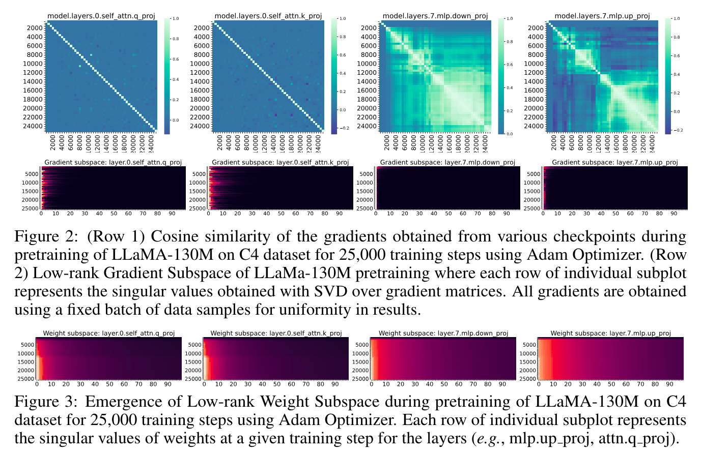
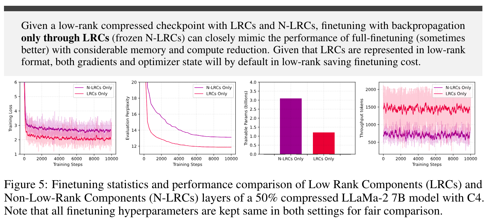

# From GaLore to WeLore: Memory-Efficient Finetuning with Adaptive Low-Rank Weight Projection
---
```This repository is under development and will be continuously updated (with additional results, fixes). Upcoming experiments on LLaMa-3.```

> **Authors:** [Ajay Jaiswal](https://ajay1994.github.io/), [Lu Yin](https://zhegan27.github.io/), [Zhenyu Zhang](https://www.linkedin.com/in/xianzhi-du-1b128934), [Shiwei Liu](https://shiweiliuiiiiiii.github.io/), [Jiawei Zhao](https://jiawei-zhao.netlify.app/), [Yuandong Tian](https://yuandong-tian.com/), [Zhangyang Wang](https://vita-group.github.io/index.html)

> **Paper Link:** [LINK]

## Abstract

Modern Large Language Models (LLMs) are composed of matrices with billions of elements, making their storage and processing quite demanding in terms of computational resources and memory usage. Being significantly large, such matrices can often be expressed in low-rank format with potential to relax resource requirements. Unlike prior works which focus on developing novel matrix decomposition algorithms, in this work we first study the *emergence of low-rank structures* across matrices within different layers of LLMs and establish a consequential relationship between the gradient dynamics and emerging low-rank expressiveness of matrices. Our findings reveal that different layers exhibit varying levels of converged low-rank structure, necessitating a non-uniform rank reduction across them to minimize performance drop due to compression. WeLore presents a simple yet effective post-pretraining heuristic, which capitalizes the *heavy-tail distribution of singular values* to identify a suitable rank reduction ratio for matrices within LLMs. WeLore categorizes weight matrices into Low-rank Components (LRCs) and Non-Low-rank Components (N-LRCs) based on their ability to express themselves as low-rank. Our gradient perspective and extensive experiments illustrate that LRCs tend to have better finetuning capabilities and can closely mimic (sometimes outperform) the training loss trajectory and performance of full-finetuning (LRCs and N-LRCs jointly) with notable memory and compute footprint reduction. Finetuning a 50\% compressed LLaMa-2 7B model using only a fraction of parameters in LRCs (WeLore) can outperform its full-finetuning with ~3x better throughput and ~0.6x GPU requirement.

---





## Update
- [x] (06.01.2024) We released the code for WeLore.
- [x] (06.01.2024) We provided support for LLaMa-2 7B and 13B experiments.


## Installation 
--- 
Step 1: Clone this repository and navigate to `WeLore` folder

```
git clone https://github.com/VITA-Group/WeLore.git
cd WeLore
```

Step 2: Create the conda environment:

```
conda create -n WeLore python=3.9
conda activate WeLore
```

Step 3: Install relevant packages:

```
conda install pytorch==1.10.1 torchvision==0.11.2 torchaudio==0.10.1 cudatoolkit=11.3 -c pytorch -c conda-forge
pip install transformers==4.28.0 datasets==2.11.0 wandb sentencepiece
pip install accelerate==0.18.0
pip install shortuuid tqdm
```

Step 4: Download pre-computed SVD singular values for `LLaMa-7B and LLaMa-13B` ([Link](https://utexas.box.com/s/g0tfx09mfq133atqcnjbn8jm7blqwu2q)) and save to `./data` folder.

Step 5: Download Low-rank compressed Model Checkpoints for downstream finetuning of `LLaMa-7B` [Link](https://utexas.box.com/s/g0tfx09mfq133atqcnjbn8jm7blqwu2q) and save to `./checkpoints` folder.


## Usage

--- 
We provide a quick overview of the important arguments:  
- `--model`/`--model_config`: The identifier for the LLaMa model on the Hugging Face model hub.
- `--cache_dir`: Directory for loading or storing LLM weights. The default is `llm_weights`.
- `--min_ratio`: WeLore condition to represent W = A x B if W's `reduction-ratio` is > `min_ratio`.
- `--model_rank`: Denotes the Effective rank reduction we would like to acheive.
- `--unset_wandb`: Denotes if we want to log the finetuning/inference logs to WandB.
- `--path_rank_k_checkpoint`: Specifies the path (`Step 5`) of the WeLore compressed and continual finetuned model which can be tested for downstream tasks.
- `--singular_value_path` : Specifies the path of the pre-computed singular values (`Step 4`) of pre-trained HuggingFace Checkpoints.
- `--dataset`: Downstream datasets. We currently support `CommonsenseQA`, `SVAMP`, `BoolQ`, `CoinFlip`, `BigBench`, `StrategyQA`.


--- 
### Script example of WeLore Adaptive Low-Rank Reduction

```
CUDA_VISIBLE_DEVICES=0 python welore_rank_reduction.py \
    --model meta-llama/Llama-2-7b-hf \
    --cache_dir ./llama_weights
    --model_rank 50 \
    --singular_value_path ./data/singular_values_llama-2-7b.pt \
    --project welore-project \
    --name low-rank-pruning-test 
```

### Script example of WeLore Compressed Continual Finetuning 

```
CUDA_VISIBLE_DEVICES=0 python welore_continual_finetune.py \
    --model meta-llama/Llama-2-7b-hf \
    --cache_dir ./llama_weights
    --model_rank 50 \
    --singular_value_path ./data/singular_values_llama-2-7b.pt \
    --lr 5e-5 \
    --batch_size 4 \
    --total_batch_size 4 \
    --num_training_steps 10000 \
    --warmup_steps 500 \
    --dtype bfloat16 \
    --eval_every 500 \
    --save_dir ./finetune_adaptive \
    --save_every 500 \
    --project welore-project \
    --name low-rank-continual-finetuning-test 
```

### Script example of WeLore Compressed Downstream Finetuning 

```
CUDA_VISIBLE_DEVICES=0 python welore_continual_finetune.py \
    --model meta-llama/Llama-2-7b-hf \
    --cache_dir ./llama_weights
    --model_rank 50 \
    --singular_value_path ./data/singular_values_llama-2-7b.pt \
    --path_rank_k_checkpoint <PATH-to-Compressed-Checkpoint> \
    --lr 1e-4 \
    --batch_size 8 \
    --total_batch_size 8 \
    --num_training_steps 1000 \
    --warmup_steps 500 \
    --dtype bfloat16 \
    --dataset strategyqa \
    --project welore-project \
    --name low-rank-downstream-test 
```

**More details coming soon!**

---

If you find our work useful, please consider us citing:

```
@article{jaiswal2024WeLore,
  title={From GaLore to WeLore: Memory-Efficient Finetuning with Adaptive Low-Rank Weight Projection},
  author={},
  journal={arXiv preprint arXiv:2310.01382},
  year={2024}
}

```

For any correspondance, email us at: [ajayjaiswal@utexas.edu](ajayjaiswal@utexas.edu)